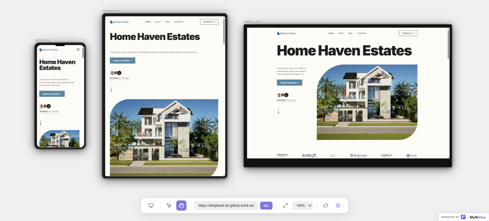

# 04-real-estate



A modern, visually-driven real estate landing page designed to showcase property listings, highlight key features, and streamline client inquiries.

🔗 **[View Live Demo](https://shepherd-bit.github.io/04-real-estate/)**

---

## 🚀 Features
* **Property Showcases:** Elegant cards highlighting key property details, images, and pricing.
* **Fully Responsive Design:** Tailored layouts that adapt seamlessly across mobile, tablet, and desktop screens.
* **Interactive Elements:** Smooth transitions, responsive navigation, and user-friendly contact/inquiry structures.

## 🛠️ Tech Stack
* **Markup:** HTML5 (clean, structured, and semantic)
* **Styling:** CSS3 (modern layouts using Flexbox/Grid, custom responsive styling)
* **Interactivity:** Vanilla JavaScript

## 💻 How to Run Locally

This is a completely static, client-side frontend project, which means there is no complex backend server setup required:

1. **Clone the repository:**
   ```bash
   git clone [https://github.com/shepherd-bit/04-real-estate.git](https://github.com/shepherd-bit/04-real-estate.git)